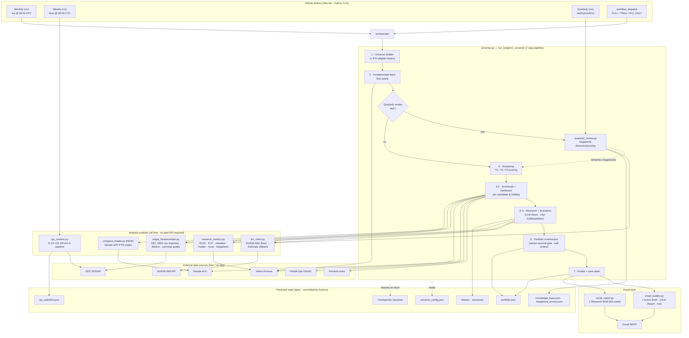

# Autonomous Long-Term Investment Screener

An autonomous, **zero-cost** equity research pipeline that screens the market for
**15–20 year compounders**, writes a full investment thesis for each candidate,
constructs a portfolio, and emails you a Goldman-style research brief — entirely
on a **free GitHub Actions** schedule with **free data sources** and a **free LLM**.

> Horizon is deliberately long. Every rating and metric is expressed in
> long-term terms (`CORE HOLD / ACCUMULATE / TRIM / EXIT / MOONSHOT`,
> 10-year bull/base/bear scenarios, sector-survival to 2040+). Technicals and
> news are **background context only**, never the basis of a decision.

---

## Architecture



---

## The pipeline

`screener.py :: run_longterm_screener()` runs a resumable 7-step pipeline. Each
step checkpoints to `data/checkpoints/` so a timed-out Actions run resumes where
it left off instead of restarting.

| Step | Stage | What it does |
|------|-------|--------------|
| 1 | **Universe** | Builds the candidate ticker list and folds in IPO-eligible names that have cleared the 180-day cooling period. |
| 2 | **Fundamentals** | Two-pass fetch of fundamentals from Yahoo Finance for the whole universe. |
| — | **Quarterly review** *(if due)* | Discovers/deprecates megatrends and rewrites `universe_config.json`, then refreshes the in-memory megatrend snapshot **before** screening. |
| 3 | **Screening** | Scores every name and tiers it **T1 / T2 / T3** (established compounder → emerging → moonshot). |
| 3.5 | **Technicals + Sentiment** | Per candidate *and* existing holding: 200-day MA / 52-week range / 1yr-vs-QQQ, Finnhub news, Reddit, SEC 8-K events, institutional holders, and the **Senate congressional-trading** signal. |
| 4–5 | **Research + Scenarios** | LLM writes a 20-year thesis (moat, management, kill-risk) and a 10-year **bull / base / bear** market-cap scenario per candidate; hallucinated/flat/inverted scenarios are sanitised and regenerated. |
| 6 | **Portfolio construction** | Applies a top-down **sector-survival** gate (blocks doomed sectors, tightens per-sector caps), sizes positions by valuation, then runs an LLM **self-review** of its own decisions. |
| 7 | **Emails + persist** | Sends the emails, updates `portfolio.json` (adds/exits/migrations + run history), and clears checkpoints. |

---

## Modules

| File | Role |
|------|------|
| `screener.py` | Orchestrator + all pipeline steps, portfolio logic, SMTP send. |
| `research_metrics.py` | Yahoo-derived quality metrics: ROIC, FCF yield, **valuation label** (CHEAP/FAIR/RICH/EXTREME + PEG), insider buy/sell signal, moat proxy, megatrend alignment. No paid API. |
| `edgar_fundamentals.py` | SEC EDGAR XBRL: 5-year trajectory (ROIC/margins/revenue), **serial-dilution** detection, **earnings-quality** trend, customer-concentration from 10-K text. |
| `congress_trades.py` **(new)** | Free, official **Senate eFD** Periodic Transaction Reports → per-ticker `BUYING/SELLING/MIXED/NONE` signal. Senate-only, degrades to `unavailable` if the feed is blocked. |
| `llm_client.py` | Provider-agnostic LLM. **NVIDIA NIM free tier** (llama-3.1-8b) with an automatic model fallback chain, Anthropic Claude as paid fallback. JSON-constrained prompts. |
| `ipo_monitor.py` | SEC EDGAR IPO pipeline (S-1/F-1/S-4/Form D) → `ipo_watchlist.json`, with a 180-day cooling period before a name enters screening. |
| `quarterly_review.py` | Megatrend discovery + scoring (Layer 3); merges accepted trends into `universe_config.json`. |
| `email_builder.py` | **Email 1 — Action Brief** (this month's moves + signal chips), **Email 3 — Exit Report**, and the trial fallback. |
| `email_report.py` | **Email 2 — Research Brief**: dense per-holding cards (quality, capital structure, valuation & integrity, technicals, sentiment, congress, thesis + scenarios). |

---

## Data sources (all free, no paid key)

- **Yahoo Finance** (`yfinance`) — prices, fundamentals, holders, insider transactions.
- **SEC EDGAR** — companyfacts XBRL, submissions, full-text (fundamentals, dilution, IPOs).
- **Finnhub** — company news headlines *(free API key)*.
- **Reddit** — mention counts; public endpoint, optional OAuth for reliability.
- **Senate eFD** (`efdsearch.senate.gov`) — congressional stock trades *(Senate only)*.
- **NVIDIA NIM** — free LLM inference for research and reviews.
- **Gmail SMTP** — delivery of the three emails.

---

## Outputs (emails)

1. **Action Brief** — the short list of moves this month, with valuation / insider /
   dilution / **senators buying-selling** signal chips and trim/exit advisories.
2. **Research Brief** — full research card per holding + an executive-summary table
   banded to long-term language (conviction High/Medium/Lower, vs-QQQ Ahead/In line/Behind).
3. **Exit Report** — realised return, alpha vs QQQ, and months held for any exits.

Persisted state lives in `data/` (`portfolio.json`, `theses/`, `scenarios/`,
`knowledge_base.json`, `megatrend_scores.json`, `ipo_watchlist.json`) and is
committed back to the repo by the Actions workflow.

---

## Scheduling

Defined in `.github/workflows/longterm_monthly.yml`:

| Job | Cron | Purpose |
|-----|------|---------|
| Main screener | `0 8 1 * *` | Full pipeline, 1st of each month 08:00 UTC. |
| IPO monitor | `0 6 * * 1` | Weekly IPO-pipeline scan (Mondays 06:00 UTC). |
| Quarterly review | `0 7 1 */3 *` | Megatrend discovery/scoring (Jan/Apr/Jul/Oct). |

Manual runs via **workflow_dispatch** support `FULL`, `TRIAL`
(stops after screening and sends a preview), and `IPO_ONLY`.

---

## Configuration & secrets

**All tunables live in `universe_config.json`** — email recipients, LLM provider/model
and fallback chain, megatrend definitions, and screening thresholds. Edit that file,
not `screener.py`.

Required GitHub **Actions secrets**:

| Secret | Purpose | Required |
|--------|---------|:--------:|
| `NVIDIA_API_KEY` | Free NVIDIA NIM LLM | yes |
| `FINNHUB_API_KEY` | News headlines | yes |
| `GMAIL_SENDER` / `GMAIL_PASSWORD` | SMTP send (app password) | yes |
| `EMAIL_RECIPIENT` | Primary recipient | yes |
| `ANTHROPIC_API_KEY` | Paid LLM fallback | optional |
| `REDDIT_CLIENT_ID` / `REDDIT_CLIENT_SECRET` | Reddit OAuth (more reliable mentions) | optional |

---

## Local development

The environment runs on **Python 3.11** in CI. Install dependencies with:

```bash
pip install -r requirements.txt
```

Run the whole pipeline locally (needs the secrets above as env vars):

```bash
python screener.py                  # full run
RUN_MODE=TRIAL python screener.py   # stop after screening, send preview
python ipo_monitor.py               # IPO scan only
python quarterly_review.py          # megatrend review only
```

> **Note on Python versions:** CI pins **3.11**. If you develop on 3.12+, validate
> before pushing — some newer f-string syntax (e.g. a backslash inside an
> expression) parses locally but fails on 3.11:
> ```bash
> python -c "import ast; ast.parse(open('email_report.py').read(), feature_version=(3,11))"
> ```

Email HTML can be previewed offline with `gen_preview.py`
(writes `preview_action.html` / `preview_research.html`).
